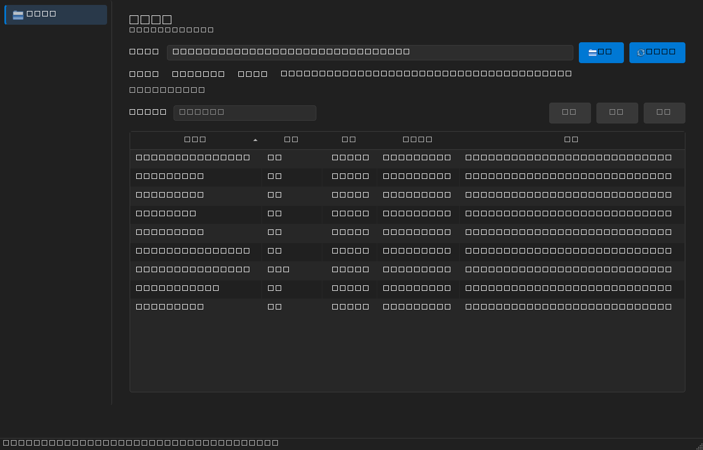
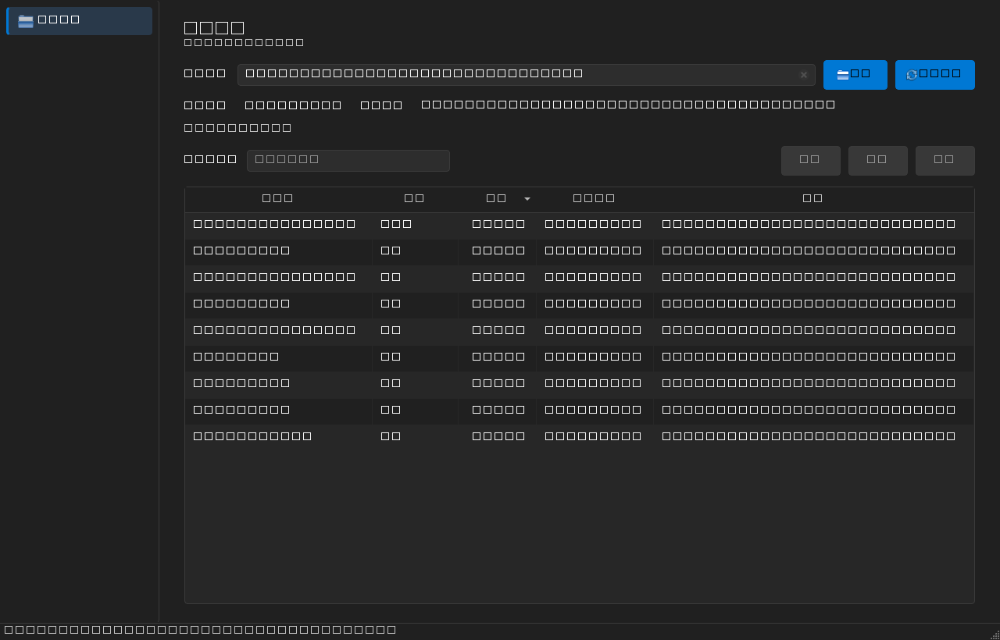
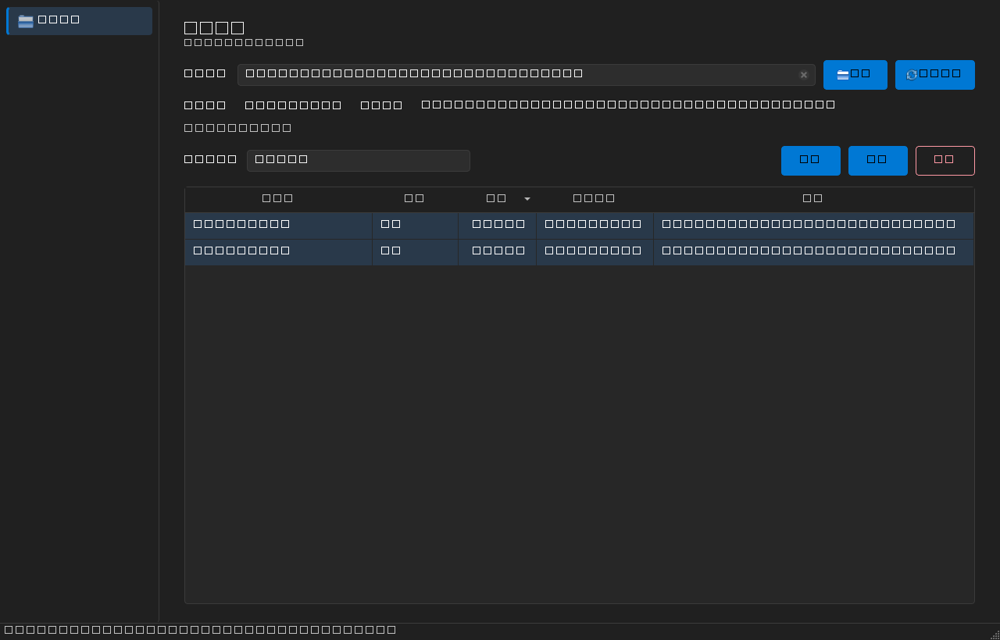

# FilePilot

一个使用 C++ / Qt 开发的 Windows 桌面文件管理工具，用于扫描、查看、搜索和整理本地文件。

## About This Project / 项目说明

FilePilot is a learning-oriented Windows desktop file management application developed by a sophomore computer science student.

FilePilot 是一名大二计算机科学与技术专业学生的 C++ / Qt 学习与实践项目。项目通过一个完整的 Windows 桌面应用，练习 C++、Qt Widgets、Model/View、signal / slot、文件系统操作、CMake 和 Git。

这个项目的目标不是提供企业级文件管理方案，而是完成一个功能完整、结构清楚、可以理解和维护的桌面应用。当前 v1 有意保持较小的功能范围，重点放在真正会使用的核心文件操作上。

## Features / 当前功能

- 选择文件夹
- 扫描文件
- 显示文件名、类型、大小、修改时间和路径
- 图片、视频、文档、压缩包、其他分类
- 按文件名搜索，不区分大小写
- 按文件名、类型和大小排序
- 单选和多选文件
- 复制文件
- 移动文件
- 删除文件
- 删除确认
- 文件不存在、目标路径不存在、目标文件已存在、权限不足等基础错误提示
- 移动和删除后刷新当前文件列表

## Screenshots / 界面截图

### 主界面

完成扫描并显示文件列表：



### 排序

按文件大小排序后的列表：



### 搜索和多选

搜索文件并多选后显示文件操作区域：



这些截图使用真实构建的 FilePilot 程序和测试目录生成，没有使用 AI 生成的软件界面。

## Tech Stack / 技术栈

- C++17
- Qt 6
- Qt Widgets
- CMake
- Git
- MinGW 64-bit
- Qt Test / CTest

当前 CMake 工程仍保留以前开发的 Qt SQL、Backup、Duplicate 等模块，因此构建时仍会链接 Qt SQL。这些模块不属于当前 v1 用户主流程。

## Architecture / 当前架构

文件扫描和列表：

```text
MainWindow
    ↓
FileOrganizePage
    ↓
ScanTask
    ↓
ScanService
    ↓
ScanResult
    ↓
FileTableModel
    ↓
QTableView
```

搜索和排序：

```text
FileTableModel
    ↓
QSortFilterProxyModel
    ↓
QTableView
```

基础文件操作：

```text
FileOrganizePage
    ↓
BasicFileOperations
    ├── copy()
    ├── move()
    └── remove()
```

`ScanTask` 管理后台扫描生命周期，并通过 Qt signal / slot 把进度、错误和结果发送给界面。`ScanService` 只负责遍历目录和收集文件信息。`FileTableModel` 将 `std::vector<FileInfo>` 提供给 Qt Model / View。`BasicFileOperations` 只实现 v1 需要的基础文件操作。

## Project Structure / 项目结构

```text
src/app/
    程序入口和 MainWindow

src/ui/pages/
    文件扫描、搜索、排序和操作页面

src/ui/models/
    Qt Model / View 文件数据模型

src/core/scan/
    文件遍历和扫描结果

src/core/tasks/
    ScanTask 后台扫描任务

src/core/filesystem/
    BasicFileOperations 和文件系统辅助代码

src/core/
    保留的高级模块源码

tests/
    Qt Test 和 CTest 测试

resources/
    图标和 Qt 资源

docs/
    项目截图和文档
```

## Build / 构建

环境要求：

- Windows 10 或 Windows 11
- Qt 6.5 或更高版本
- MinGW 64-bit
- CMake 3.21 或更高版本
- Ninja

请先把本机 Qt、MinGW 和 CMake 的可执行文件目录加入 `PATH`，并设置 Qt 的 `CMAKE_PREFIX_PATH`。

Debug：

```powershell
cmake --preset windows-mingw-debug
cmake --build --preset debug
```

Release：

```powershell
cmake --preset windows-mingw-release
cmake --build --preset release
```

运行：

```powershell
.\build\windows-mingw-release\src\filepilot.exe
```

## Testing / 测试

```powershell
ctest --preset debug --output-on-failure
ctest --preset release --output-on-failure
```

当前测试结果：

```text
Debug CTest: 15/15 passed
Release CTest: 15/15 passed
```

测试覆盖文件扫描、分类、搜索、排序、多选、复制、移动、删除和基础错误路径。

## Current Scope / 当前范围

当前 v1 的重点是：

```text
选择文件夹
    ↓
扫描
    ↓
查看、分类、搜索和排序
    ↓
选择文件
    ↓
复制、移动或删除
```

项目有意保持功能较少，方便阅读、调试和在面试中解释。

## Known Limitations / 已知限制

- 跨磁盘移动暂不使用 Copy + Delete fallback。
- 不提供 Undo、回收站或删除恢复。
- 批量文件操作不是原子操作，失败时不会自动回滚已经成功的项目。
- 重复文件检测、Hash、Backup 和 SQLite 历史记录不属于当前 v1 主流程。
- 高级自动整理规则和复杂任务系统仍保留在源码中，但不是当前学习重点。

这些是当前版本的范围控制，不代表功能缺陷或永久不会扩展。

## Learning Goals / 学习目标

通过这个项目实践：

- C++ 基础和文件系统操作
- Qt Widgets 桌面界面
- Qt Model / View
- Signals and Slots
- 文件扫描、搜索、排序和基础文件操作
- CMake 构建
- Git 和 GitHub 项目发布
- Debug / Release 和自动化测试

## Future Improvements / 后续计划

- 根据实际使用体验优化 UI
- 完善跨磁盘移动
- 完善批量操作的错误反馈
- 根据实际需要逐步扩展功能

## License

FilePilot 使用 [MIT License](LICENSE) 发布。

第三方组件说明见 [THIRD_PARTY_NOTICES.md](THIRD_PARTY_NOTICES.md)。