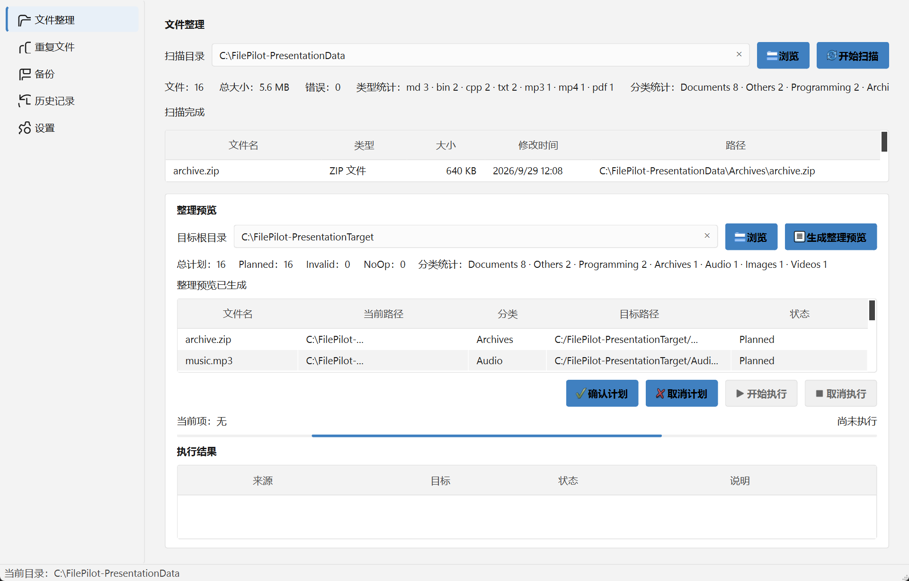
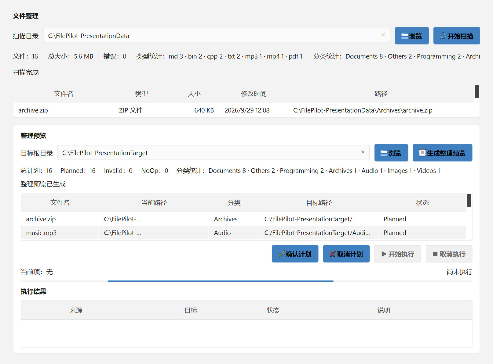
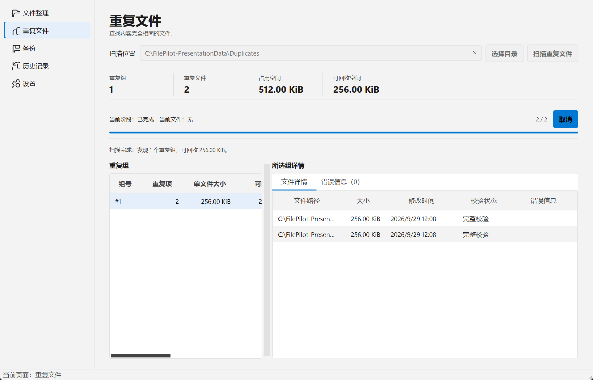
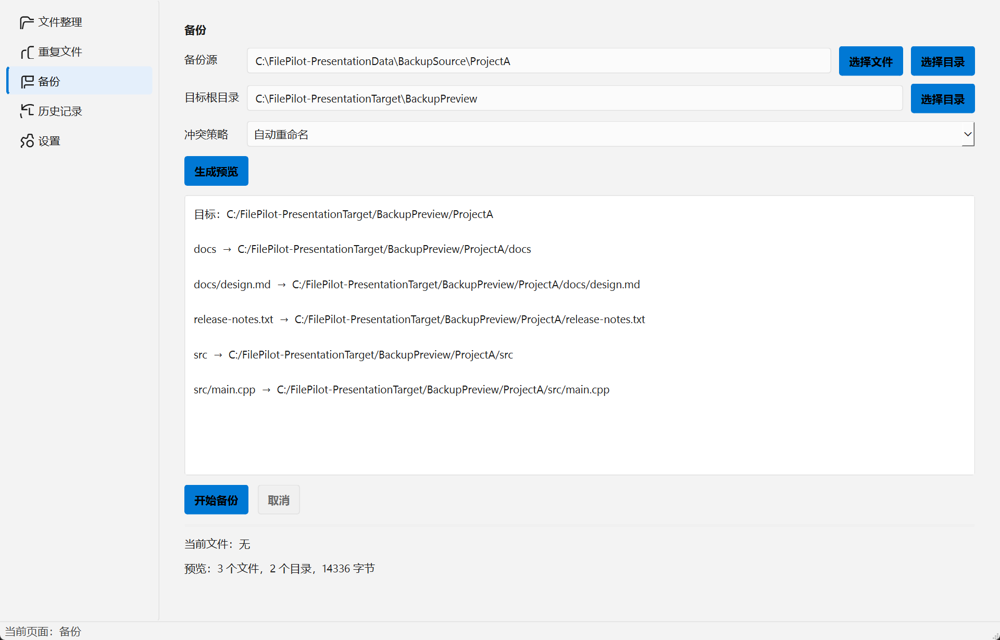
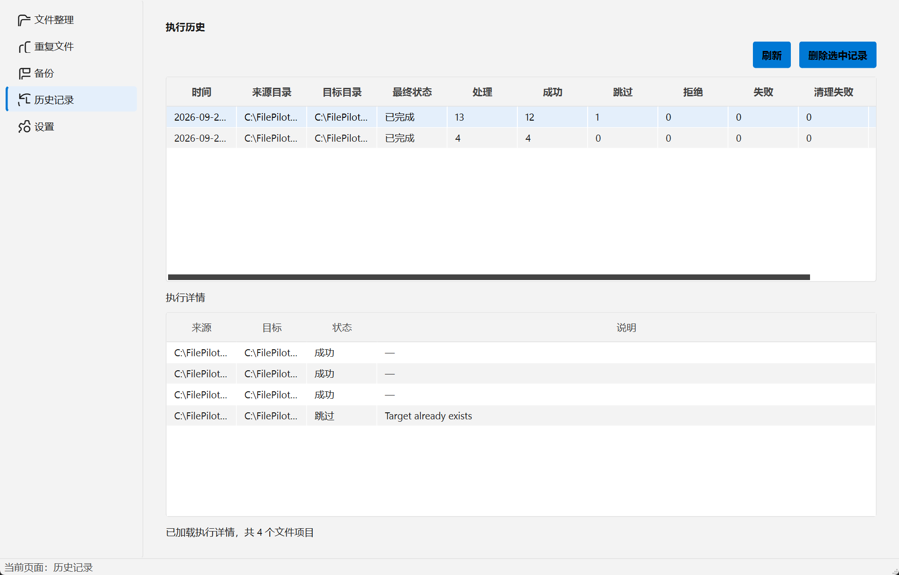
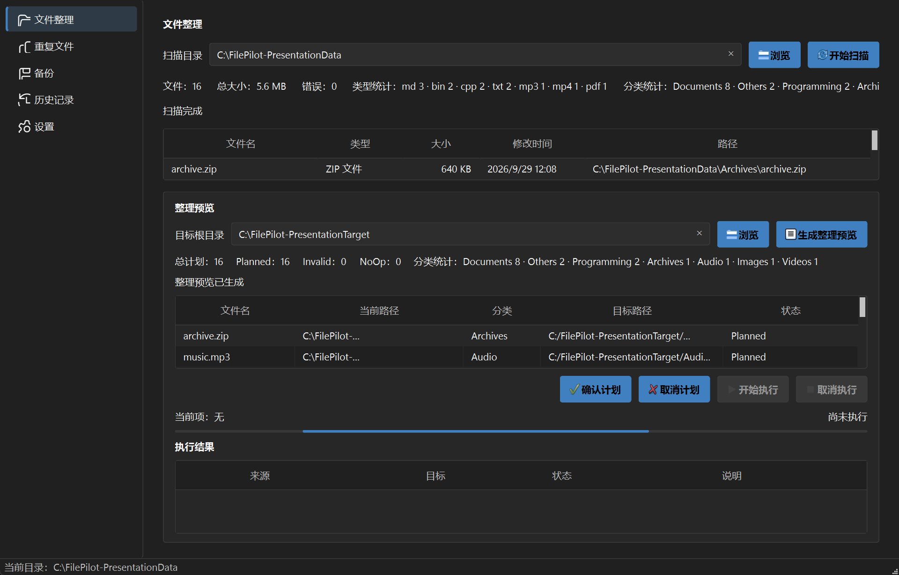
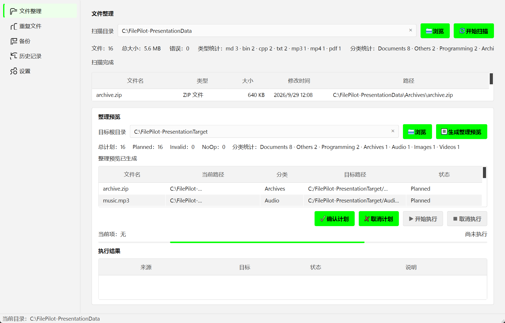

# FilePilot

Windows 11 local file organization and backup tool built with C++17, Qt 6 and SQLite.


[](https://github.com/Star-InK-s/FilePilot/actions/workflows/ci.yml)




## Overview

FilePilot is a local-first Windows desktop application for scanning, organizing, analyzing, and backing up local files. It combines a C++17 core, a Qt 6 Widgets interface, SQLite persistence, and Windows theme integration in a single desktop application.

## Features

- File scanning with type/category statistics, progress, errors, and cancellation
- Rule-based classification and organization preview
- Conflict policies for planned destinations
- Duplicate detection by file size and SHA-256 content verification
- Single-file and directory backup with source preservation
- Backup staging, revalidation, SHA-256 verification, and final publish
- SQLite execution and backup history persistence
- Windows 11 Light, Dark, Accent, High Contrast, and DPI adaptation
- Qt Test and CTest coverage for core, UI smoke, organization, duplicate, theme, and backup paths

## Screenshots

### Organization Preview



### Duplicate Finder



### Backup



### History



### Theme Adaptation

| Dark theme | Accent theme |
| --- | --- |
|  |  |

## Architecture

FilePilot keeps scanning, planning, execution, persistence, and presentation as separate layers:

```text
Scan -> Classification -> Organization Planning -> Preview -> Execution Core -> SQLite History
Duplicate Finder -> Size/Hash Analysis -> Duplicate Groups
Backup Plan -> Prevalidation -> Staging -> SHA-256 Verification -> Publish -> Backup History

WindowsThemeDetector -> ThemeSnapshot -> ThemePalette -> ThemeStyleSheet/QtThemeApplier -> Pages
```

The Duplicate Finder and Backup flows are independent from organization planning. The theme pipeline follows the current Windows system state instead of maintaining a separate visual design system.

## Safety Design

- Backup preserves the source and copies through a staging tree.
- Source and destination identities are revalidated before publish.
- Backup content is verified with SHA-256 before final publication.
- Reparse points, junctions, and unsafe path relationships are rejected.
- Cancellation stops work that has not completed and preserves verified published results.
- Conflict policies support Skip, Overwrite, and AutoRename flows.
- History is persisted in SQLite for review.

These checks reduce filesystem risk; they do not claim to eliminate every Windows TOCTOU race.

## Tech Stack

- C++17
- Qt 6 Widgets, SQL, and Test
- CMake and Ninja
- MinGW 64-bit
- SQLite
- CTest
- Windows API

## Build

Prerequisites:

- Windows 11
- Qt 6.5 or newer with the MinGW 64-bit kit
- MinGW 64-bit
- CMake 3.21+
- Ninja or MinGW Makefiles

The paths below are generic examples. Replace them with your local Qt and MinGW locations.

```powershell
$env:Path = "C:\Qt\Tools\mingw1310_64\bin;C:\Qt\Tools\CMake_64\bin;C:\Qt\Tools\Ninja;C:\Qt\6.11.1\mingw_64\bin;" + $env:Path
$env:CMAKE_PREFIX_PATH = "C:\Qt\6.11.1\mingw_64"

cmake --preset windows-mingw-release
cmake --build --preset release
```

Debug build:

```powershell
cmake --preset windows-mingw-debug
cmake --build --preset debug
```

## Run

Run the built application from the build tree:

```powershell
.\build\windows-mingw-release\src\filepilot.exe
```

For a deployable folder, use Qt `windeployqt` and include the Qt SQL SQLite plugin, MinGW runtime, `README.md`, `LICENSE`, and `THIRD_PARTY_NOTICES.md`. Build directories, CMake caches, logs, and test output must not be packaged.

## Testing

```powershell
ctest --preset debug --output-on-failure
ctest --preset release --output-on-failure
```

The v1.0.0 validation suite reports 185 passed, 0 failed, and 3 skipped QtTest cases. This is a recorded v1.0.0 validation result, not a guarantee for every future environment. Current local verification also passes all 15 CTest targets in both Debug and Release configurations.

## Download

Download [`FilePilot-v1.0.0-Windows-x64.zip`](https://github.com/Star-InK-s/FilePilot/releases/tag/v1.0.0) from GitHub Releases.

SHA-256:

```text
5ADBAE3455EC8DDD3141DEEA7DD4E866AA2518CD9F5591DC7AB38BF79A58349E
```

The ZIP is a portable Windows application bundle and includes the Qt and MinGW runtime files required by the current release.

## Known Limitations

- No incremental backup.
- No cloud synchronization.
- No scheduled backup.
- No network backup.
- No advanced backup version chain.
- No duplicate auto-delete.
- No Undo.
- The v1.0.0 organization UI exposes scanning, planning, preview, and confirmation, while the end-to-end Execute button remains disabled.
- A successful backup can finish while history persistence reports an SQLite `NOT NULL` error when the backup error message is empty.

## Roadmap

Possible future directions:

- Enable end-to-end organization execution from the v1 UI.
- Add regression coverage for successful backup-history persistence.
- Incremental and scheduled backup policies.
- Safer duplicate review and cleanup workflows.
- Undo and recovery assistance for completed organization runs.

## License

FilePilot is released under the [MIT License](LICENSE).

Third-party components and source provenance are documented in [THIRD_PARTY_NOTICES.md](THIRD_PARTY_NOTICES.md).
